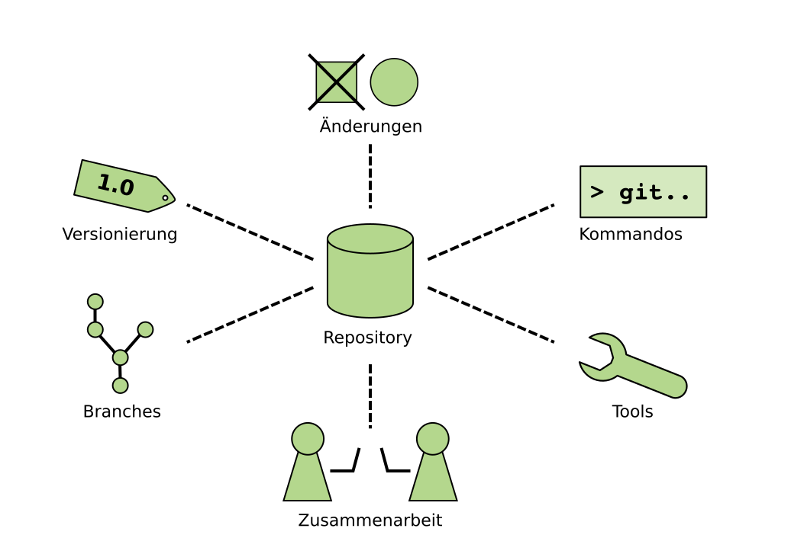
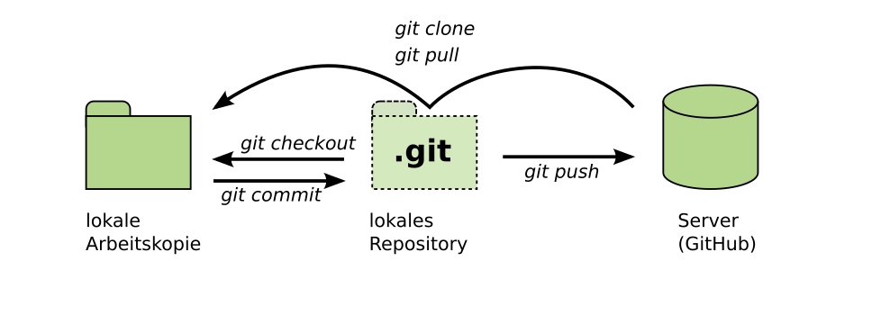

# Versionskontrolle mit Git

Dies ist ein kurzes Tutorial in die Versionskontrolle mit dem Programm `git`.

## Was ist Versionskontrolle?

**Versionskontrolle ist eine Kombination aus Logbuch und Zeitmaschine für Programmcode.**

Ein System zur Versionskontrolle protokolliert automatisch *Änderungen* in Deinem Programmcode und anderen Dateien im Projekt. Du kannst dadurch:

* Ideen ausprobieren, ohne Das Programm kaputt zu machen.
* Zu früheren Versionen und wieder zurück springen.
* Das gleiche Programm auf mehreren Computern editieren.
* Mit mehreren Leuten parallel an einem Projekt arbeiten.
* Dein Projekt im Netz veröffentlichen.

Versionskontrolle ist der erste Schritt, um professionell Programme zu entwickeln. Sobald Du mit Versionskontrolle anfängst, ist es schwer, damit wieder aufzuhören.

## Voraussetzungen

Du solltest in der Lage sein, Dich in einer Kommandozeile zu bewegen.

## Installation

Git ist ein Programm für die **Kommandozeile**.

Unter Windows findest Du die Installationsdateien unter [https://book.git-scm.com/downloads](https://book.git-scm.com/downloads).

Unter Ubuntu Linux ist `git` sehr leicht zu installieren:

    sudo apt install git

Es gibt mehrere [graphische Oberflächen](https://book.git-scm.com/downloads/guis) für `git`. Diese sind aus meiner Sicht aber nicht unbedingt notwendig.

## Aufgabe: Veröffentliche Dein Programm auf GitHub

Bei dieser Aufgabe verwendest Du `git`, um ein Programm veröffentlichen. Genauer, tauschen der **GitHub**-Server und Deine lokale Arbeitskopie Änderungen miteinander aus. Dazu dienen die `git`-Befehle:

### 1. Erstelle ein GitHub-Projekt

* Lege Dir ein Konto auf [**GitHub**](https://github.com/) an.
* Erstelle dort ein neues Repository.
* Gib dem Repository einen Namen und eine Beschreibung.
* Erstelle auch eine `README.md`-Datei (*optional*).
* Wähle die MIT-Lizenz aus (*optional*).

### 2. Erstelle eine lokale Arbeitskopie

* Gehe auf die Startseite Deines GitHub-Projekts.
* Finde den Knopf **Clone or download** (grün).
* Drücke darauf. Kopiere die URL des Projekts.
* Öffne ein Terminal (Eingabeaufforderung; `cmd` im Startmenü eingeben)
* Wechsle in das Verzeichnis, an dem das Projekt liegen soll (z.B. Desktop)
* Gib ein `git clone URL`, wobei Du hier die kopierte URL einfügst.
* Es sollte ein neues Verzeichnis mit Deinem Projekt entstehen.

### 3. Dateien hinzufügen

* Kopiere die Dateien für Dein Projekts in das neue Verzeichnis.
* Gib `git status` ein.
* Füge eine Datei mit `git add DATEINAME` hinzu.
* Gib `git status` ein.
* Speichere die Änderungen mit `git commit -m "Logbucheintrag"`
* Gib `git status` ein.
* Du kannst mit `git add *.py` oder `git add *.cpp` auch mehrere Dateien hinzufügen. **Füge zunächst nur den Quelltext und wichtige Medien hinzu.**

#### Achtung:

Falls Du bei `git commit` das `-m` vergisst und in einem komischen Editor landest, kannst Du diesen mit `ESCAPE` und `:q!` wieder verlassen.

### 4. Dateien ignorieren

Einige Dateien haben im Repository nichts zu suchen: *Verzeichnisse wie `Debug/`, `__pycache__`, `.exe`-Dateien, Layout-Dateien* und viele mehr. Hier weist Du `git` an, diese zu ignorieren.

* Suche Dir auf [https://github.com/github/gitignore](https://github.com/github/gitignore) eine passende Datei für Deine Programmiersprache.
* Speichere den Inhalt im Projektverzeichnis in einer Datei namens `.gitignore`.
* Füge die Änderungen mit `git add` und `git commit` wie oben hinzu.
* In die Datei `.gitignore` kannst Du auch von Hand Namen Dateien und Verzeichnissen eintraegen (ein Dateiname pro Zeile).

### 5. Änderungen veröffentlichen

Nun kannst Du alle Änderungen veröffentlichen.

* Prüfe, ob sich im Projekt urheberrechtlich geschütztes Material befindet.
* Ergänze eventuelle Lizenzbestimmungen oder Namensnennungen in der README-Datei.
* Mit `git rm DATEINAME` kannst Du Dateien ohne Nutzungsrechte löschen.
* Gib in der Kommandozeile `git push` ein.
* Beim ersten Mal wünscht sich `git`, dass Du Name und E-Mail angibst. Dazu werden zwei Befehle mit `git config ..` angezeigt. Kopiere diese und passe sie an.
* Versuche `git push` erneut.
* Aktualisiere die Webseite des Projekts. Du solltest dort die neuen Dateien sehen.

### 6. Zeitreisen

* Zeige mit `git log` die Geschichte des Projekts an.
* Jeder Eintrag hat einen Buchstabencode, z.B. `276fde136c067c5c622ec03ea1b0b..`
* Mit `git checkout CODE_EINSETZEN` kannst Du zu früheren Revisionen springen.
* Mit `git checkout master` kommst Du wieder in die Gegenwart.

### 7. Kollaboration

Entwickelt Euer Projekt im Zweierteam weiter.

* Füge auf der Webseite einen zweiten Autor (*Collaborator*) hinzu.
* Mit `git clone URL` kann dieser sich eine Kopie des Projekts besorgen.
* Wenn Ihr Dateien ändert, müßt Ihr die Änderungen jedes Mal mit `git add` und `git commit` einchecken.
* Mit `git pull` könnt Ihr beide die aktuellste Version des Codes anfordern.
* Verwende stets `git pull` unmittelbar vor `git pull`.
* Mit `git push` könnt Ihr beide die Änderungen veröffentlichen.
* Falls Ihr beide die gleiche Stelle in der gleichen Datei ändert, meldet `git` einen Konflikt. Diesen müßt Ihr von Hand auflösen, bevor Ihr `git add/commit` verwendet.

## Welche Versionskontrollsysteme gibt es?

Heute sind vor allem drei Systeme zur Versionskontrolle üblich:

* [git](https://git-scm.com/) – Das mit Abstand beste und am weitesten verbreite dezentrale System. Wurde von Linus Torvalds entwickelt. Praktisch alle großen Open-Source-Projekte laufen unter `git`.
* [Mercurial (hg)](http://hginit.com/) – Weniger komplexes und einfacher zu lernendes dezentrales System.
* [Subversion (SVN)](https://subversion.apache.org) – Ein sehr gutes, zentralisiertes System. Wird vor allem in Softwarefirmen verwendet.

Für kleinere Projekte (Doktorarbeiten und kleiner) sind alle drei Systeme bestens geeignet. `git` ist aber das am meisten genutzte.

## Links

* [Git Dokumentation](https://book.git-scm.com/doc)
* [Try GitHub - online-Tutorial](https://try.github.io/)
* [GitHub - öffentliches Repository](https://github.com/)
* [Learn Git auf Codecademy](https://www.codecademy.com/learn/learn-git)
